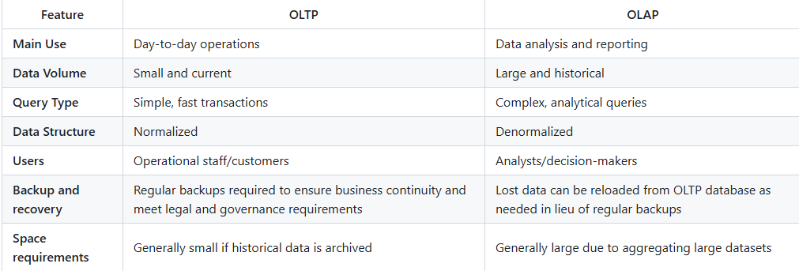
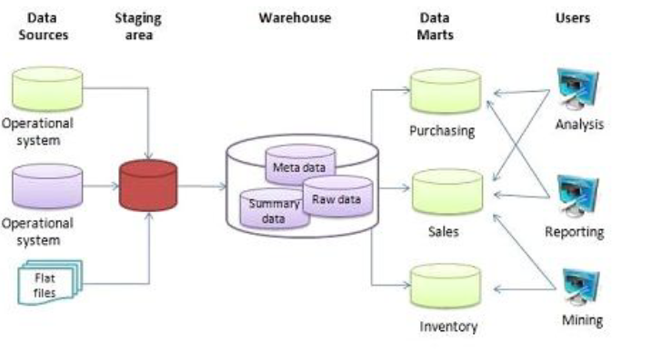

# Week 3 - Data Warehouse

## OLAP vs OLTP

Ambas deficiones son de procesamiento de datos, la diferencia radica en que el OLTP alamacenada datos que dan soporte diario a la organizacion permitiendo consulta y actualizacion de datos trasaccionales de manera confiable y eficiente miestras los sistemas OLAP combina y agrupa datos historicos de diferentes fuentes y sn datos para la toma decisiones de alta direccion (informes, graficos, tendencias, ect) y son con un formato de CUBO. Para cargar datos a sistemas OLAP ejecutamos flujos de trabajos ETL/ELT.



## Data Warehouse

Es una alamcén de grandes volumenes de información (OLAPT), los datos deben alamcenarse de forma segura, fieable, facil de recuperar y de administrar.
En estos repositorios encontramos datos estructurados (tablas de base de datos, hojas de Excel) y datos semiestructurados (archivos XML, páginas web) y los datos fluyen desde diversos orígenes.
Es usado prinicipalmente para reporte y analisis dentro de las organizaciones.



## What's BigQuery

BigQuery es un sistema data wareouse seveless de google capas de manejar grandes cantidades de data. Es capaz de ejecutar consultas SQL de una manera rapida sobre datos provistos desde distintas fuentes, tambien permite la integracion de realizar modelos ML y visualizacion de datos.

BigQuery is commonly used for data warehousing, business intelligence, and data analytics tasks.

For more information, visit the [BigQuery page](https://cloud.google.com/bigquery?hl=es).

## Buenas practicas en BigQuery

Devido a que esta plataforma realiza cargos por alamcenamiento y consulta de nuestros queries, debemos tener buenas practicas para mmaximixar los costos.

- Evitar SELECT *
- Onsultar el precio de la consulta antes de ejecutarla
- Usar particiones (PARTITIONS) y agrupamiento (CLUSTERING)
- Filtrar por columnas particionadas
- Denormalizar la data
- Redcir la cantidad de informacion antes de JOIN

Consultar los tipos de tabla de BigQuery.

Informacion sobre tablas y crecion [Tables](https://cloud.google.com/bigquery/docs/tables?hl=es-419)

```sql
CREATE TABLE IF NOT EXISTS mydataset.mytable (
    id STRING,
    first_name STRING,
    last_name STRING,
    dob DATE
)
```

```sql
CREATE TABLE mydataset.trips AS (
  SELECT
    bike_id,
    start_time,
    duration_minutes
  FROM
    bigquery-public-data.austin_bikeshare.bikeshare_trips
);
```

### Grouping

Grouping in BigQuery is done using the `GROUP BY` clause in SQL. This allows you to aggregate data based on one or more columns. For example, you can group data by a specific column and then apply aggregate functions like `COUNT`, `SUM`, `AVG`, etc., to get summarized results.

Example:
```sql
SELECT
    column1,
    COUNT(*) AS count
FROM
    dataset.table
GROUP BY
    column1;
```

### Clustering

Clustering in BigQuery is a technique used to optimize the performance of queries by organizing data based on the values of one or more columns. When you create a clustered table, BigQuery automatically sorts the data based on the specified clustering columns. This can significantly improve query performance, especially for queries that filter or aggregate data based on the clustering columns.

To create a clustered table, you can specify the clustering columns when creating the table:

Example:
```sql
CREATE TABLE dataset.table
CLUSTER BY column1, column2 AS
SELECT
    *
FROM
    source_table;
```

Clustering can be particularly beneficial when used in combination with partitioning, as it helps to further optimize query performance by reducing the amount of data scanned.